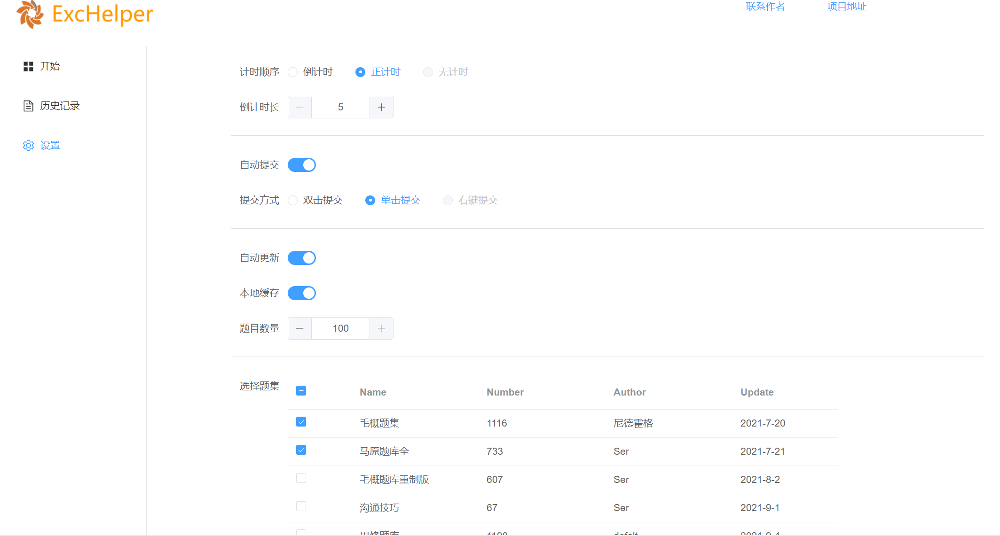

# exchelper5

### 和3.0相比

1.题目数据存放在服务器端，减小了本地缓存压力

2.完善了选题，做题机制，根据选题数量生成做题的界面，也减小了一次展示的题量，优化响应速度

3.完善了本地存储逻辑，由缓存+服务器+本地存储三种形式相互配合进行数据存储

4.题目数据和用户数据分离，设计更加合理

5.添加了仿github的note设计，用户历史查询，用户计时，倒计时等功能

## 使用指南

### 1 基本介绍

ExcHelper 5.0为Vue构建的SPA静态应用，可以通过以下网址访问: [https://hggshiwo.github.io/exchelper/index.html#/](https://hggshiwo.github.io/exchelper/index.html#/)

App分为4个界面:

- Home: 

  

  左侧导航栏可以访问不同界面，

  中间显示用户题集，点击则进入做题界面，

  下方为note，为4*7的方块阵列，分别代表该月的一天，颜色随用户在天的做题数量不断加深

- Exc:

  

  通过点击Home的题集进入，

  左侧显示具体的数据，包括题集名称，花费/所剩时间，完成进度，准确率(未提交前始终为0)

  点击提交按钮进行提交。提交完成后点击返回按钮返回到历史记录页面。
  
  中间为题目，单击题目选项进行选择。注意多选不会被额外标注，多选和单选唯一的区别为：多选可以选择多个选项，单选只能选择一个选项
  
  未提交刷新页面，则丢失本次记录
  
- 历史记录页面

  

  点击查看，查看该次记录。点击删除，删除该次记录。注意：删除记录不可逆。

  搜索框可以对日期或者题目集名称进行筛选

- 设置界面

  

设置界面可以对app进行设置，

计时顺序表示做题时时间显示逻辑

倒计时长表示倒计时的时间长度

题目数量表示单次做题的题目生成数量（如果题目集剩余题目数量不足则按照剩余题目数计算）

题目集表示用户选择的题目集，会在Home界面展示。

单击确定按钮保存设置，跳转到Home界面。注意，如果没有提交则会失去本次设置。


## 数据约定和逻辑

欢迎开发者对题库进行补充和测试，通过GET请求可以获取数据：

获取题目集列表url：https://hggshiwo.github.io/static/index.json，数据返回格式见数据格式介绍

获取具体题目集url: https://hggshiwo.github.io/static/excName.json，excName是题目集的名称，数据返回格式见数据格式介绍

关于题库扩充，请与开发者联系。

### 数据格式

State中保存: 

- settings, 用户设置

```json
 setting: {
      countDown: true, //是否是倒数
      span: 50, //倒数的时长
      autoSubmit: true,//是否自动提交
      submitWay: "sc",//提交方式为single click，单击
      autoFresh: true, //自动更新
      localStorage: true,//本地存储
      num: 20,//每次做题时题目数量
 },
```

- myExc, 用户加入的题集，具体实现为key-value对，key为题集的名称

```json
{
	"xxx":{ 
        last:"2022:2:9:12:23:12", //最后一次访问的时间
        total:100, //题目总数
        done:20, //题目完成数量
        proper:5 //正确的题目数
    }
}
```

- history，用户做题历史，具体实现为key-value对, key是提交的时间戳

```json
{
	"2022:2:9:12:23:12":{
		exc:"test1", //题目集名称
		done:{ //详细的做题数据
			"xxxx":{"A":true,"B":false,"C":false}, //key-value对，表示某题用户提交的情况，true为选择了该选项
			"xxxx":{"A":true,"B":false,"C":false},
		},
		start_time: 12:00:20,//开始时间
		end_time: 12:00:11, //结束时间
		span: 00:00:11 //持续时间
		num: 0, //做题总数
		proper: 0, //正确数
	}
}
```

- note: 二维数组4*7, 保存了该月第n周中第m天的做题数量

state中另外包含了update: false，在开始时会从localStorage中读取缓存的state


服务器中保存：

- 题目集本身 exc.json ：key为题目，

```json
{
	"00000“:{
		text:"xx", //题目文字
		choices:{ 
		"A":"xxx", //选项和选项对应的文字
		"B":"xxx"
		},
		multi: false, //是否是多选
		key:["A"] //答案
	}
}
```

- 题目集索引，会在setting的table中进行展示 key为题目集名称，

```json
{
    "毛概题集": {
    "path": "毛概题集.json", //题目集路径
    "total": 1116, //题目集总数
    "update": "2021-7-20", //题目集更新时间
    "author": "尼德霍格"//题目作者
    },
}
```

### 逻辑

Home页面逻辑：

点击题集->根据历史生成题集id->请求数据->显示

Exc页面逻辑:

点击提交->生成历史记录, 修改myExc,history,note等

Setting页面逻辑

点击设置->请求数据->和myExc对比->显示数据，修改settings


